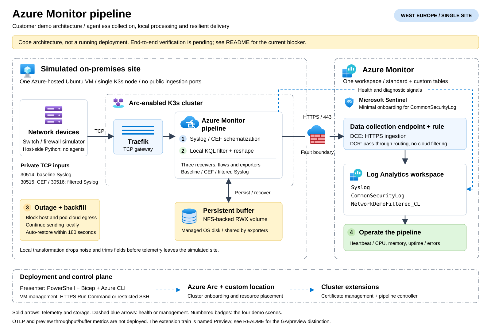

# Azure Monitor pipeline customer demo

A disposable simulated site in **West Europe**: one Ubuntu 24.04 VM, one
Arc-enabled K3s node, Azure Monitor pipeline, and one Log Analytics workspace.
Microsoft Sentinel is onboarded only to make the standard `CommonSecurityLog`
table available. There are no agents on the simulated switches or firewalls.

> Deployment and live verification status is recorded in `artifacts\`.
> A successful ARM deployment alone does not mean the demo works.
> Use `Test-Demo.ps1 -Scene All -RestartCollector` before presenting.

**Live validation status (2026-10-01): blocked, not presentation-ready.**
The directory-permission blocker is resolved. The West Europe foundation,
K3s/NFS, Arc connectivity, Custom Locations, certificate extension `1.2.0`,
pipeline extension `1.7.0`, and DCE/DCR were deployed successfully. Pipeline
creation remains blocked: its root CA certificates are Ready, but the managed
`arc-amp-root-ca-current` and `arc-amp-client-root-ca-current` secrets are missing,
leaving their ClusterIssuers unready. An operator restart did not resolve this.
All four end-to-end scenes remain unverified. Diagnostics are saved locally;
the failed disposable deployment was removed to avoid ongoing charges.
Offline tests are not a substitute for a successful live rehearsal.

## Architecture and scope

[](docs/architecture.svg)

[Open the full-size, editable SVG](docs/architecture.svg).
The drawing shows the architecture defined in code, not a currently running
deployment. Numbered badges identify the four demo scenes; solid arrows show
telemetry/storage paths and dashed blue arrows show health or management paths.
The three ingestion inputs are separate finite replays, not an always-on
duplicated stream. Unlike a multi-site production architecture, this demo uses
one simulated site and does not deploy OTLP clients, dashboards, or alert rules.

The Azure VM simulates an on-premises site; it is not itself on premises.
The single node and its locally hosted NFS server are intentionally not highly
available. The buffer is on the managed OS disk, not ephemeral VM storage.
Deleting the VM deletes the buffer.

With `-UseRunCommand`, management uses Azure's HTTPS VM agent channel and all
public inbound traffic is denied. Alternatively, only SSH from the presenter's
`/32` is allowed; the Kubernetes API is accessed through an SSH tunnel.
Synthetic Syslog/CEF traffic is plaintext
inside this isolated VM; TLS is explicitly disabled on these demo receivers.
Azure ingestion remains HTTPS. This is not a production security configuration.

| Capability | Status and treatment |
| --- | --- |
| Syslog/CEF ingestion, built-in schematization | GA; required |
| Local transformations and persistent buffering | Core pipeline capability; required |
| Heartbeat, diagnostic error logs, CPU/memory/uptime | Required operations scene |
| Accepted/rejected/export/processor/buffer metrics | Preview; not required or used to prove success |
| OTLP logs | Preview; deliberately not deployed |

The installation guide currently uses a `Preview` extension release train,
although pipeline reached GA in April 2026. A release-train or ARM API suffix is
not a capability's support statement. The demo uses the documented installation
train and the stable `2026-04-01` pipeline API. Confirm your customer's approval
of this distinction before presenting it as an approved deployment choice.

## Prerequisites

- Azure subscription with permission to create resources, register providers,
  onboard Arc, enable custom locations, and assign the Monitoring Metrics
  Publisher role to the extension identity at DCR scope.
- West Europe quota and availability for a 4-vCPU VM. Default:
  `Standard_D4s_v6`. Size can be overridden; no silent region fallback.
- PowerShell 7.2+, Azure CLI, Bicep, OpenSSH (`ssh`, `scp`, `ssh-keygen`),
  `kubectl`, and Python 3.11+ on the deployment workstation.
- Azure CLI extensions: `connectedk8s`, `k8s-extension`, `customlocation`,
  `log-analytics`.
- Outbound HTTPS for Azure, package repositories, GitHub, K3s, and container
  registries. SSH mode additionally needs outbound SSH from the workstation.
  Run Command mode requires VM Run Command permissions and temporarily grants
  the VM identity Azure Arc Kubernetes Cluster Contributor on only the dedicated
  resource group to onboard Arc. The assignment ID is saved before creation,
  cleanup is verified in `finally`, and resume reconciles leftover assignments
  before executing guest commands. Workstation termination can delay cleanup
  until resume or teardown; this is not an independently expiring assignment.
- Permission to read the tenant's Custom Locations service-principal object ID,
  or an administrator-provided `-CustomLocationsOid`. The deployment checks this
  before provisioning; Azure subscription ownership does not grant directory read.

```powershell
az login
az extension add --name connectedk8s
az extension add --name k8s-extension
az extension add --name customlocation
az extension add --name log-analytics
```

K3s is pinned to `v1.33.3+k3s1`, a version explicitly listed by Microsoft Learn.
Pipeline defaults to `1.7.0`, Helm to `3.19.0`, and Traefik chart to `41.6.1`.
The certificate extension version is discovered by its first deployment, recorded,
and automatic upgrades disabled; pass `-CertificateVersion` on subsequent fresh
deployments to reproduce it. The Ubuntu image resolves `latest` at initial
creation; capture the resolved image version from Azure for an exact rebuild.
Do not upgrade collectors or change replica count while buffered data remains.
Bootstrap raises `fs.inotify.max_user_instances` to at least `1024`, persistently,
because the co-located Arc and certificate sidecars exhausted Ubuntu's default
`128` during live deployment. Higher existing limits are preserved.

## Deploy

Use a new dedicated resource group name. HTTPS-only management is suitable for
workstations that cannot reach SSH (including the development network):

```powershell
.\scripts\Deploy-Demo.ps1 `
  -Name ampdemo01 `
  -UseRunCommand `
  -SubscriptionId "<subscription-guid>"
```

For lower-latency management on a network that permits SSH, replace
`-UseRunCommand` with `-AdminCidr <your-public-IPv4>/32`. A corporate VPN/proxy can
use a different address for SSH than HTTPS; never broaden the rule to the Internet.
Run Command adds at least 20 seconds per operation and preserves longer output
in `/var/tmp/pipeline-demo-*.log`; JSON evidence transfers are length-checked.

The script runs Bicep what-if before
each deployment, bootstraps the cluster, connects Arc, installs extensions,
checks that the managed certificate issuers are Ready, creates DCE/DCR and scoped
RBAC, deploys pipeline and diagnostics, and sends a
real Syslog/CEF canary. Provision before the customer meeting.

The resource group is `rg-<Name>`. State, SSH key, kubeconfig, manifests, and
verification evidence stay in ignored `artifacts\`. Keep this directory private;
it contains administrative credentials. SSH uses first-use host-key trust and
rejects changed host keys. Do not share or commit the artifacts directory.

Re-run the same command to resume after fixing a failure. Recorded extension
versions and release trains are reused; mismatches require an explicit upgrade
outside this deployment workflow. A mismatched ownership
tag prevents accidental adoption/deletion of another environment. To manage
another demo, use a different `-StatePath`.

### Optional temporary certificate repair

Normal deployment stops if managed certificate initialization fails. For an
explicitly approved, disposable demo only, add `-AllowDemoCertificateRepair`
to the deploy command. Pass it again on every resume; consent is not cached.

```powershell
.\scripts\Deploy-Demo.ps1 `
  -Name ampdemo01 `
  -UseRunCommand `
  -SubscriptionId "<subscription-guid>" `
  -CertificateVersion 1.2.0 `
  -AllowDemoCertificateRepair
```

The helper is restricted to pipeline `1.7.0` and Certificate Manager `1.2.0`.
It first allows ordinary initialization to finish. If the known missing
`*-current` Secret failure remains, it validates both source CA certificates
and matching keys, the issuers, the actual trust-bundle selectors, and the
certificate controller's Secret namespace before creating anything.
It creates only the missing current-CA copies, with the active-CA labels
selected by the existing trust bundles. Existing unowned or changed copies
are never overwritten. A partial retry can revalidate this deployment's copies.
The helper requires at least 24 hours of CA validity and verifies issuer
readiness and actual CA propagation to selected trust-bundle ConfigMaps.
Public fingerprints, expiry, and the outcome are saved in
`artifacts\<Name>-certificate-repair.log`; private keys never leave the VM.

**This changes extension-owned certificate lifecycle resources and is not a
production fix or a demonstration of automatic CA rotation.** The copied CA
material does not track future changes to the source Secrets; 24 hours of
remaining CA validity is a precondition, not a guaranteed safe operating window.
Use a fresh environment for a short rehearsal/presentation and tear it down
afterward. Do not use it for a customer's actual telemetry or PKI.
Microsoft documents [automated certificate lifecycle and rotation](https://learn.microsoft.com/azure/azure-monitor/data-collection/pipeline-tls-automated);
the copy-and-label workaround itself is not a documented Microsoft procedure.
[BYOC](https://learn.microsoft.com/azure/azure-monitor/data-collection/pipeline-tls-custom)
remains an unverified fallback if the scoped repair cannot unblock provisioning.

## Rehearse and validate

```powershell
python -m unittest discover -s tests
.\tests\Test-Orchestration.ps1
.\scripts\Test-Demo.ps1 -Scene All -RestartCollector -Verbose
```

A run produces `artifacts\demo-<timestamp>-<id>.json` plus sender manifests.
Only a completed live run writes `status: Passed`. Records are reconciled by exact
sequence IDs; duplicates are reported separately. Sender socket success does not
prove ingestion. The test fails on missing IDs, unexpected filtered records,
incorrect parsing, ineffective isolation, or absent heartbeat/runtime metrics.

Default batches have 1,000 records, of which exactly 700 are noise and 300 useful.
Traffic is finite, approximately 100 records/second. Retention is 30 days and the
workspace daily cap is 1 GB; the cap is an emergency guard, not a precise budget.
The VM, disks, public IP, Log Analytics, and Sentinel may incur charges. Remove
the demo when finished; merely stopping the simulator does not stop Azure costs.

## Fifteen-minute runbook

Open the workspace's **Logs** blade before starting. Keep a recent successful
rehearsal available because ingestion and metric export have asynchronous latency.
Each scene command prints an evidence path; use its `runId` in the corresponding
saved query. The individual scene tests can wait up to 15 minutes, so switch to
the clearly identified rehearsal run rather than waiting through a live timeout.

| Time | Scene | Exact command | Evidence |
| --- | --- | --- | --- |
| 0-3 min | Agentless Syslog/CEF | `.\scripts\Test-Demo.ps1 -Scene Ingestion` | `queries\01-ingestion.kql`: named devices and parsed CEF vendor/product fields |
| 3-7 min | Filter and reshape locally | `.\scripts\Test-Demo.ps1 -Scene Filtering` | `queries\02-filtering.kql`: 1,000 baseline versus 300 retained records; smaller ingested size |
| 7-12 min | Outage and backfill | `.\scripts\Test-Demo.ps1 -Scene Backfill` | `queries\03-backfill.kql`: source times precede delayed ingestion; all IDs eventually arrive |
| 12-15 min | Operate the pipeline | `.\scripts\Test-Demo.ps1 -Scene Health` | `queries\04-health.kql`: fresh heartbeat and three GA runtime metrics |

For scene 2, inspect `infra\pipeline.bicep`: the `TransformLanguage` processor runs
after local Syslog parsing and before export. The cloud DCR only passes data
through. The reduced custom schema omits the 512-character padding field. The
baseline is a separate finite replay, not an always-on unfiltered mirror.
`_BilledSize` is ingestion size, not wire bytes or a quoted cost saving.

For scene 3, the local nftables rule blocks external traffic for both host and
pods, including existing export connections. Local Kubernetes/NFS/Syslog traffic
and SSH replies remain available. A generation-scoped systemd timer removes only the demo firewall
table after at most 180 seconds even if the workstation disconnects. The test
restores it earlier in the local script's exit trap. A previous timer cannot
restore a subsequent outage. The complete fault transaction runs on the VM, so
Run Command can return its result after egress has been restored. The sender
never replays the outage batch. Before/after DCE probes run in both the host and
collector network namespaces, with DNS resolved before isolation. Evidence
includes rejected packet counters, bound/mounted PVC, changed buffer files, and
collector UIDs. Ingestion before restoration fails verification (two-second
clock tolerance). Backfill batches are limited to 3,000 records to fit the timer.
Use `-RestartCollector` during rehearsal to test persistence through a pod restart.

Health KQL contains separate query statements. Replace the pipeline name and
resource ID from `artifacts\state.json`. Diagnostic error tables might not exist
until an error occurs; an empty errors query is not proof of health.

## Recovery and fallback

Restore a fault immediately without Azure Arc:

```powershell
. .\scripts\Common.ps1
$state = Read-DemoState .\artifacts\state.json
Invoke-DemoSsh $state 'sudo bash /home/demoadmin/demo/scripts/linux/outage.sh stop'
Invoke-DemoSsh $state 'sudo k3s kubectl get pods,pvc,svc -n pipeline-demo'
```

If no logs arrive, check receiver/gateway ports, TLS mode, certificate extension,
PVC binding, DCR immutable ID, exact stream names, extension identity permissions,
and the workspace cap. Query/table schemas must match. Never replace a failed
pipeline with direct Logs Ingestion API uploads and claim the scene passed.

If preflight reports insufficient directory privileges, a tenant administrator
can obtain the nonsecret service-principal object ID with
`az ad sp show --id bc313c14-388c-4e7d-a58e-70017303ee3b --query id -o tsv`.
Pass the returned GUID as `-CustomLocationsOid`. The fixed application ID is
**not** the tenant-specific object ID and cannot be substituted for it.

If the certificate readiness check fails, inspect the returned ClusterIssuer
conditions. Extension `Succeeded` alone is insufficient. In the initial attempts,
cert-manager reported `ErrGetKeyPair` for the missing managed current-CA secrets,
despite successful issuance of the root certificates. The optional, guarded
demo repair above targets only this exact failure and requires explicit consent.
Do not patch managed issuers or hide repair failures. For a supported long-lived
installation, investigate the underlying lifecycle problem with Microsoft;
the demo workaround is not a substitute for that resolution.

If deployment or ingestion fails live, show the last successful rehearsal's
saved run ID and source configuration. Export screenshots or a short recording
before the meeting. Clearly label all replayed evidence with its capture time.
If no successful rehearsal exists, do not claim the demo has been validated.

## Teardown

```powershell
.\scripts\Remove-Demo.ps1 -Confirm:$false
```

This verifies the resource-group ownership tag, attempts to restore connectivity,
deletes the dedicated group (including the VM and Arc resources), and verifies
the group is gone. It also works after a partial deployment. Since the entire VM
is deleted, no Arc agents remain running on a retained host. Retain the evidence
locally; remove the specific private-key/kubeconfig files when no longer needed.

## Sources

Reviewed against Microsoft Learn on 2026-10-01:

- [Pipeline overview, GA/preview and supported configurations](https://learn.microsoft.com/azure/azure-monitor/data-collection/pipeline-overview)
- [Prerequisites and heartbeat](https://learn.microsoft.com/azure/azure-monitor/data-collection/pipeline-configure)
- [CLI/ARM configuration, identities and persistent storage](https://learn.microsoft.com/azure/azure-monitor/data-collection/pipeline-configure-cli)
- [Local transformations](https://learn.microsoft.com/azure/azure-monitor/data-collection/pipeline-transformations)
- [Gateway](https://learn.microsoft.com/azure/azure-monitor/data-collection/pipeline-kubernetes-gateway)
- [TLS modes](https://learn.microsoft.com/azure/azure-monitor/data-collection/pipeline-tls)
- [Extension versions](https://learn.microsoft.com/azure/azure-monitor/data-collection/pipeline-extension-versions)
- [Metric preview labels and export support](https://learn.microsoft.com/azure/azure-monitor/reference/supported-metrics/microsoft-monitor-pipelinegroups-metrics)
- [Certificate management deployment](https://learn.microsoft.com/azure/azure-arc/kubernetes/cert-manager-deploy)
- [GA pipeline resource schema](https://learn.microsoft.com/azure/templates/microsoft.monitor/2026-04-01/pipelinegroups)
- [VM Run Command restrictions](https://learn.microsoft.com/azure/virtual-machines/linux/run-command)
- [Custom locations and explicit service object ID](https://learn.microsoft.com/azure/azure-arc/kubernetes/custom-locations)
- [Single-node Ubuntu inotify limit guidance](https://learn.microsoft.com/azure/azure-arc/container-storage/quickstart-install)
